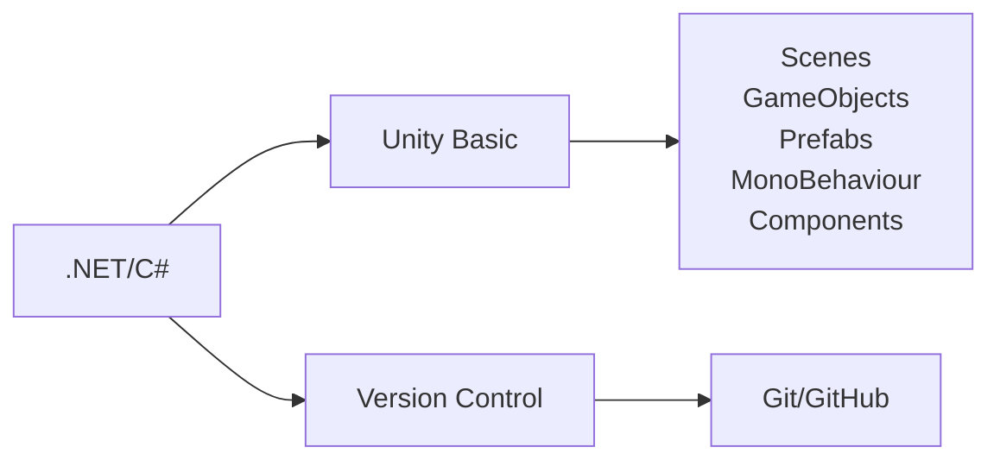

# Road Map Unity

Có phải bạn đang muốn trở thành nhà phát triển Unity. Có quá nhiều kiến thức phải học mà bạn chưa biết bắt đầu từ đâu. Tại đây, tôi sẽ lên một lộ trình giúp bạn nắm được các bước để bắt đầu con đường phát triển trò chơi trên Unity.

## 1. Basic

### .Net
- Bởi vì Unity sử dụng nền tảng .Net, nên bạn hãy tìm hiểu sơ lược về .Net để biết được Unity đã tích hợp .Net như thế nào? Nhằm mục đích gì? Có ưu điểm và hạn chế nào?
### C#
- Vì sao lại là C# mà không phải là ngôn ngữ khác? Có lẽ điều này cũng chẳng quan trọng lắm vì mình chỉ cần biết là Unity chọn C# thì chúng ta sẽ học C# =)))
- Đối với một số anh em đã làm quen hoặc biết các ngôn ngữ lập trình như C, C++ thì việc làm quen với C# sẽ nhẹ nhàng hơn rất nhiều. Còn những anh em chưa có bất kì kiến thức nào thì hãy bắt đầu từ `C# Tutorial` (`Input/Output`, `Variable`, `Data Type`, `While/For Loop`, `If/Else`, `List/Arrays`, `Math`, ...), Sau khi hiểu cơ bản phần `Tutorial` thì bạn sẽ chuyển qua `C# - OOP` (`Class/Objects`, `Constructors`, `Access Modifiers`, `Properties and Encapsulation`, `Inheritance`, `Polymorphism`, `Abstraction/Interface`, ...). Mình nghĩ sau khi nắm vững chừng đó kiến thức về C# là bạn đã có thể tự tin bắt đầu với Unity rồi.
- Hãy bắt đầu với [C# cơ bản](https://github.com/unity-learn/basic-csharp-for-unity)
