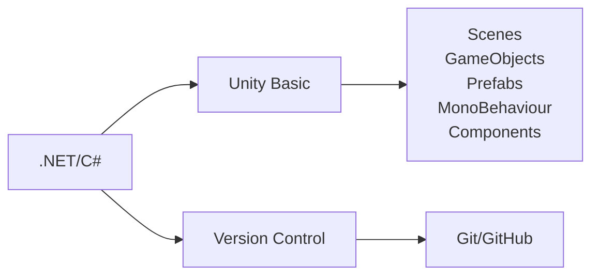
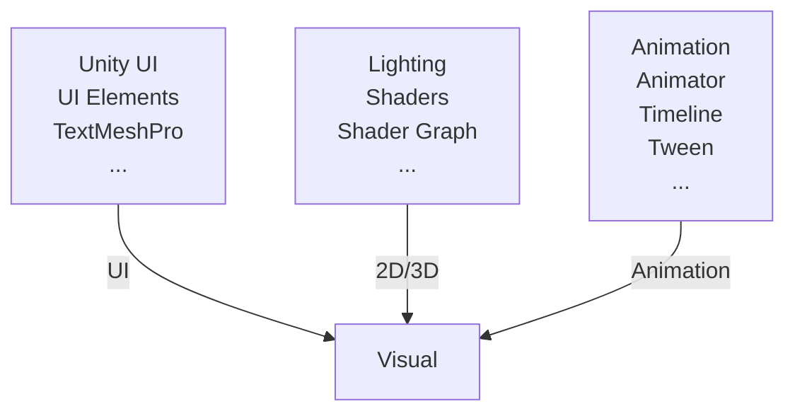

# Road Map Unity

Có phải bạn đang muốn trở thành nhà phát triển Unity. Có quá nhiều kiến thức phải học mà bạn chưa biết bắt đầu từ đâu. Tại đây, tôi sẽ lên một lộ trình giúp bạn nắm được các bước để bắt đầu con đường phát triển trò chơi trên Unity.

## 1. Basic (Cơ bản)

### .Net
- Bởi vì Unity sử dụng nền tảng .Net, nên bạn hãy tìm hiểu sơ lược về .Net để biết được Unity đã tích hợp .Net như thế nào? Nhằm mục đích gì? Có ưu điểm và hạn chế nào?
### C#
- Vì sao lại là C# mà không phải là ngôn ngữ khác? Có lẽ điều này cũng chẳng quan trọng lắm vì mình chỉ cần biết là Unity chọn C# thì chúng ta sẽ học C# =)))
- Đối với một số anh em đã làm quen hoặc biết các ngôn ngữ lập trình như C, C++ thì việc làm quen với C# sẽ nhẹ nhàng hơn rất nhiều. Còn những anh em chưa có bất kì kiến thức nào thì hãy bắt đầu từ `C# Tutorial` (`Input/Output`, `Variable`, `Data Type`, `While/For Loop`, `If/Else`, `List/Arrays`, `Math`, ...), Sau khi hiểu cơ bản phần `Tutorial` thì bạn sẽ chuyển qua `C# - OOP` (`Class/Objects`, `Constructors`, `Access Modifiers`, `Properties and Encapsulation`, `Inheritance`, `Polymorphism`, `Abstraction/Interface`, ...). Mình nghĩ sau khi nắm vững chừng đó kiến thức về C# là bạn đã có thể tự tin bắt đầu với Unity rồi.
- Hãy bắt đầu với [C# cơ bản](https://github.com/unity-learn/basic-csharp-for-unity)
### Unity Basic
- Lần đầu mở Unity Editor lên bạn sẽ thấy rất nhiều cửa sổ được bung ra, và bạn không biết nhiệm vụ của từng cửa sổ đó là gì. Vì thế, bạn sẽ cần tìm hiểu sơ qua về giao diện của Unity Editor và biết được nhiệm vụ của các cửa sổ cơ bản (`Project`, `Console`, `Hierarchy`, `Scene`, `Game`, `Inspector`).
- Tiếp theo bạn sẽ tìm hiểu về `Scenes`, `GameObject`, `Prefabs`, `MonoBehaviour`, và các `Components` phổ biến như `Transform`, `RigidBody`, `Collider`, ...
- Sau đó bạn sẽ đến giai đoạn sử dụng script được viết bằng C# để viết ra những thứ logic nhiệm màu cho sản phẩm game của mình. Đây là giai đoạn cần sự tích cực tìm tòi nghiên cứu để bạn có thể tích trữ cho bản thân một khối lượng kiến thức và kỹ năng xử lý vấn đề để có sản phẩm game tốt hơn theo thời gian.
### Version Control
- Bạn sẽ cần một kho lưu trữ dự án (bao gồm asset game như sprite, model, sound, ... và mã nguồn), bạn cần công cụ hỗ trợ để tất cả mọi người trong nhóm có thể làm việc trên cùng một dự án mà không bị xung đột, bạn cần một công cụ ghi nhớ tất cả sự thay đổi trong dự án của mình, ...
- Ở đây mình chọn [Git/GitHub](https://github.com/unity-learn/Getting-Started-with-Git) là công cụ quản lý và lưu trữ mã nguồn, nó sẽ giúp bạn xử lý tất cả các vấn đề nêu trên và còn nhiều hơn thế nữa. Bạn có thể tìm hiểu cách sử dụng Git/GitHub hoặc bất cứ công cụ nào tương tự phù hợp với bạn.

## 2. Visual (Thị giác)

### UI
- Unity UI, TextMeshPro,... không khó để tìm hiểu và làm quen với nó, xem [tại đây](https://learn.unity.com/mission/61a63fbcedbc2a0020607294?pathwayId=61a65568edbc2a00206076dd)
### 2D/3D
- Bạn cần hiểu về Lighting và cách nó hoạt động,  bạn có thể xem [tại đây](https://learn.unity.com/mission/creative-core-lighting?pathwayId=61a65568edbc2a00206076dd)
- Shader và ngôn ngữ shader. Bạn có thể tìm hiểu về phần này, nhưng mình thấy nó khá khó nhằn nên mình thường tìm kiếm các shader có sẵn hoặc sử dụng chat GPT để tạo shader mong muốn.
- Shader Graph để lập trình shader trực quan mà không phải code, xem [tại đây](https://learn.unity.com/tutorial/introduction-to-shader-graph#)
### Animation
- Animation và Animator là những thành phần cơ bản của Unity, xem [tại đây](https://medium.com/@alinulken/unity-developer-roadmap-97108405a7dd)
- Timeline phù hợp với các tình huống tạo một cảnh dài bao gồm nhiều hoạt ảnh, âm thanh, ...
- Tween: Tìm hiểu [DOTween](https://dotween.demigiant.com/), [PrimeTween](https://github.com/KyryloKuzyk/PrimeTween), [LitMotion](https://github.com/AnnulusGames/LitMotion),... Tất cả đều rất tuyệt vời. Hãy chọn một loại phù hợp với bạn nhất
