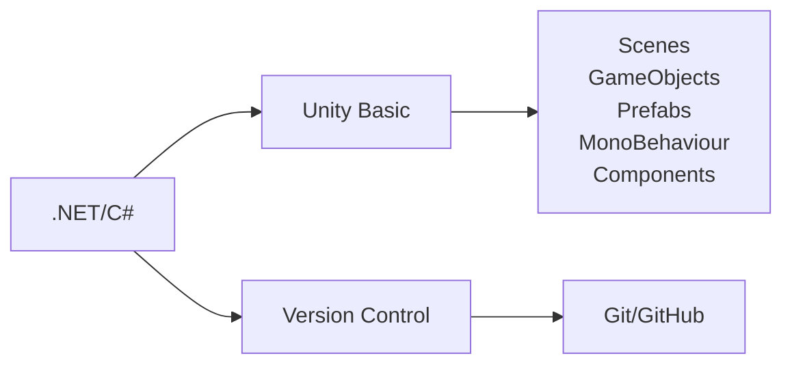

# Road Map Unity

Có phải bạn đang muốn trở thành nhà phát triển Unity. Có quá nhiều kiến thức phải học mà bạn chưa biết bắt đầu từ đâu. Tại đây, tôi sẽ lên một lộ trình giúp bạn nắm được các bước để bắt đầu con đường phát triển trò chơi trên Unity.

## 1. Basic

### .Net
...
### C#
Hãy bắt đầu với [C# cơ bản](https://github.com/unity-learn/basic-csharp-for-unity)
