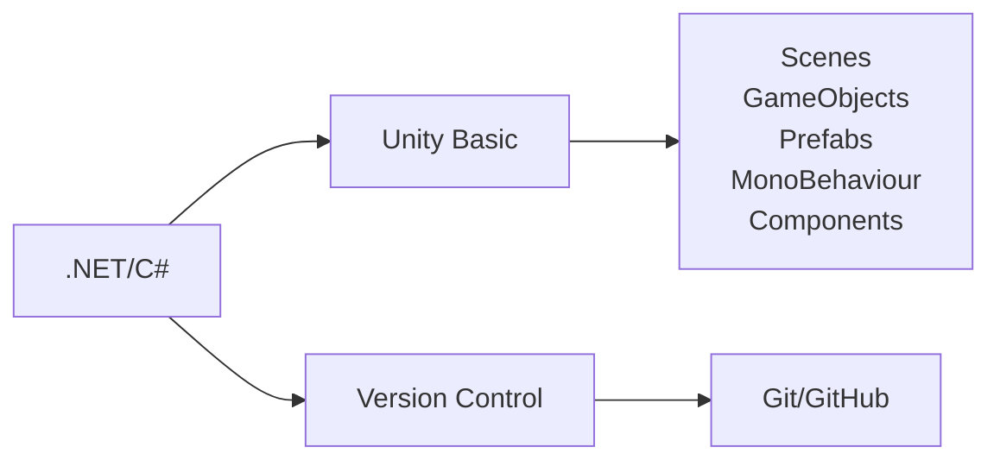

# Road Map Unity

## 1. Basic

```mermaid
flowchart LR
A[.NET/C#]
B[Unity Basic]
C[Version Control] 
A-->B
A-->C-->D[Git/GitHub]
E["Scenes<br>GameObjects<br>Prefabs<br>MonoBehaviour<br>Components"]
B-->E 

```
